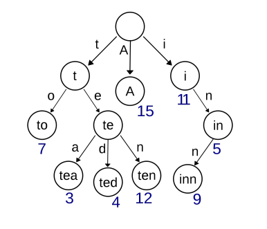
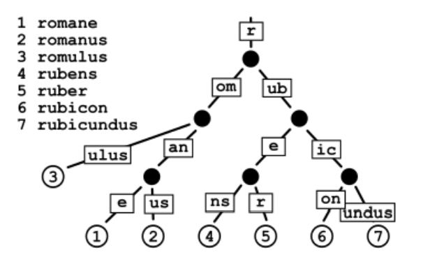
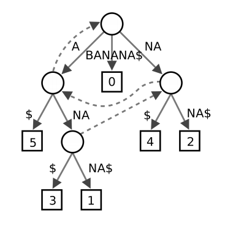

# Tarea 2

Trabajamos sobre strings, queremos:
- Contar: Cuantas veces aparece un string en un texto.
- Localizar: Las posiciones en las que aparece.
- Hacer un ranking: De los k strings de largo q que aparecen en el texto.

Buscamos trabajar con un árbol de sufijos:
- Evaluar tiempos de construcción.
- Evaluar espacio utilizado

## Estructuras para construir el índice
### Tries
Árboles que tienen los strings guardados en sus hojas. Las aristas están etiquetadas según las letras de la palabra.

> Una clase para nodo (?), que contenga la palabra parcial que se lee hasta ahí + otra info relevante.  

### Árbol Patricia
Variante del Trie en la que se reemplazan los caminos unarios por arcos. **Para la tarea se pueden utilizar distintas variantes de estos árboles.**

### Árbol de sufijos
Árbol Patricia que almacena todos los sufijos de un texto T[1,n]. El texto es terminado en $ (T[n] = $). Sólo es necesario mantener la posicion i del sufijo (**No entiendo bien por que**) 

## Objetivo de la tarea
Implementar un árbol de sufijos sobre cierto texto T[1, n] que soporte las consultas por count, locate y top-k-q nombradas.

## Preguntas:
- Que lenguaje usar? 🤣
- Basta con solo una clase para todos los nodos?
- Que información guardar en los nodos?
